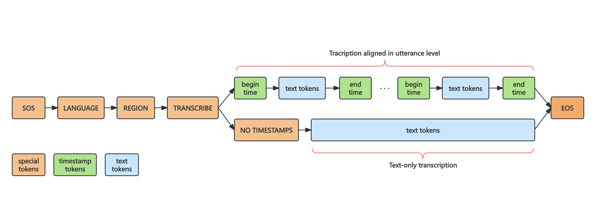

# Dolphin

Dolphin is a multilingual, multitask ASR model jointly trained by DataoceanAI and Tsinghua University. It supports 40 Eastern languages and has been trained on a large-scale dataset of 210,000 hours, which includes both DataoceanAI's proprietary datasets and open-source datasets. The model can perform speech recognition and language identification.

## Approach


Dolphin is built on Whisper and OWSM, using an attention-based encoder-decoder architecture. The encoder is Ebranchformer and the decoder is Transformer. Dolphin focuses on automatic speech recognition (ASR), its multitask data format is slightly different from Whisper's. Dolphin does not support Translation.
In addition，base on the characteristics of the DataocanAI dataset, Dolphin introduces region-specific tokens for different languages, enabling support for dialects. 

## Setup

You can install the latest version of Dolphin using the following command:
```shell
pip install -U dataoceanai-dolphin
```

Additionally, it can also be installed from source using the following command:
```shell
pip install git+https://github.com/SpeechOceanTech/Dolphin.git 
```

## Available model and languages

## Python usage

## License

Dolphin's code and model weights are released under the Apache 2.0 License. 